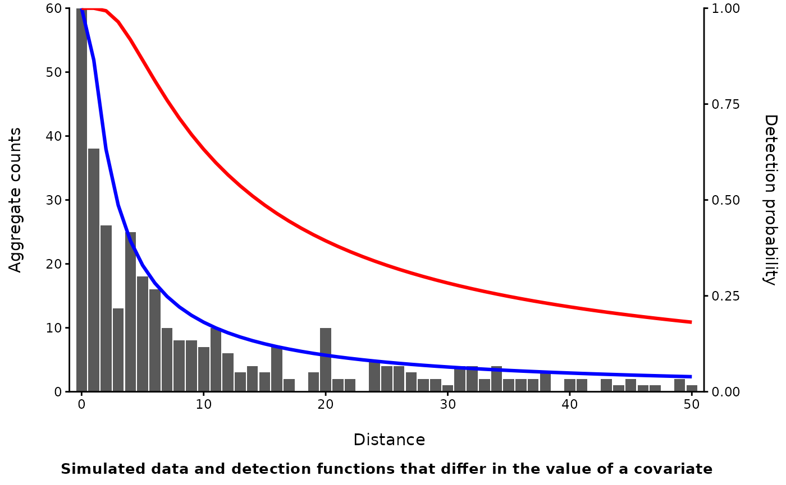

# Capture-Recapture: Closed Population Abundance Estimation- Unmarked Individuals

## Introduction

So far, the closed capture methods already discussed that require
physically capturing and marking individuals, but that need not always
be the case. There are many alternatives based on observing unmarked
individuals. They are still considered closed capture models because
they have many of the same assumptions and just like with the other
closed capture methods discussed, you are trying to estimate abundance
(or density) by estimating a capture probability. In the different
approaches that follow, the term capture probability will generally be
replaced with detection probability, given that animals are detected
(seen or heard) rather than captured.

Historically, scientists and agencies would often perform counts in
designated areas and used those counts as an index. The value of index
counts is debatable (Anderson 2001[¹](#fn1)), but converting an index
count into a more robust estimate of abundance or density is
straightforward, at least conceptually. You just need to estimate a
detection or “capture” probability. So how do you do that?

The first step is you need multiple encounters. This can be accomplished
by:

1.  Breaking up survey visits into smaller time blocks or sub-samples
2.  Performing a count or survey with multiple observers
3.  Performing the count or survey at the same location multiple times

There are specific designs for each approach and some may be better
tailored for specific needs and survey conditions.

Regardless, all the approaches have several common assumptions:

1.  There is more than one count or observation obtained
2.  The population remains closed during the counts (see the
    [overview](https://tlyons253.github.io/MDChelp/articles/CROverview.html)
    for a reminder of what closure means)
3.  Individuals are identifiable and not double counted

The first two are not new, when moving from marked to unmarked
individuals. Even the basic Lincoln-Petersen estimator requires a
minimum of two capture events. The last one technically is true for all
the other approaches too, but its often not explicit as marking animals
usually makes it easier to identify them and avoid double counting. But
it becomes more challenging to ensure when you aren’t physically marking
them. More complex methods relax this assumption, but can be difficult
to fit. It’s probably better to find an alternative method, if possible,
if you aren’t likely to be able to avoid double counting individuals.

Capture recapture of unmarked individuals will most often occur as part
of a transect survey of a fixed width or a fixed radius point count.
This is necessary to meet the closure assumption. You have to define the
spatial bounds of a survey area to have closure. This is implicit when
you have a trapping grid as is common with camera traps or small mammal
trapping. This does not mean that you can only survey one location or
one transect, just that, at each point or along each transect for the
duration of your survey (across multiple visits, observers, time,etc.),
closure exists.

When working with unmarked animals, there is also a new caveat to
“capture probability”. With marked animals, there is also the assumption
that all animals have equal catchability, or differences can be modeled
with covariates (like with behavioral responses, [closed capture
methods](https://tlyons253.github.io/MDChelp/articles/CCAMarked.html)).
When you are working with unmarked animals and reliant on a human
observer, “catchability” is now comprised of two processes: availability
and sightability. Availability is just whether all animals are behaving
in a way that makes them observable, while sightability is whether the
person making the observation can detect them. One way of thinking about
it is, availability is a function of the behavior of the animal, and
sightability is a function of the observer. Some approaches may better
be able to separate the two while in others, it’s less apparent.

Finally, the methods below, like traditional capture-recapture methods,
were primarily developed to estimate abundance, not model the
relationship between abundance and environmental covariates. Still, they
can be used within another framework, hierarchical models, to jointly
model abundance (or density) while simultaneously accounting for
imperfect detection. When moving to hierarchical models, some aspects
will be similar, but there are important differences as well as limits.
But to start, we will focus on the non-hierarchical approaches.

------------------------------------------------------------------------

## Methods

- Time of Detection
- Double observer
- Distance Sampling
- Removal Models
- Extensions

Time of detection (TOD) methods (different than time to detection
methods) are probably the most analogous to traditional capture
recapture methods. It is most often used with a single visit to a site,
making it ideal when there are many sites to visit and few resources to
make repeated visits. In short the approach is to:

- Break the single visit into several time intervals
  - The intervals need not be equal, but it is easier if they are
- During each interval, record if an individual is detected
  - You must be able to accurately keep track of individuals

This effectively creates a capture history like used in earlier
capture-recapture models. Consequently, you can use software like
Program MARK to estimate abundance. In R, the
“[**unmarked**](https://rbchan.github.io/unmarked/)” package includes
several functions that can do the same, but also adopt a hierarchical
approach such that you can also model abundance. Generally though,
modeling abundance instead of just estimating it requires many more
sites, even if using a single visit.

This approach may be best suited when there are a reasonably large
number of sites to visit, the species is relatively easy to detect, and,
observers can reliably keep track of individuals during the survey.

------------------------------------------------------------------------

Double observer counts are another useful option when multiple visits to
a site are impractical or just not possible (i.e. aerial surveys, remote
back country surveys, etc.). Double observer surveys still requires you
be able to identify and keep track of individuals, but now you are
aggregating them in counts. There are two approaches to estimating
abundance from two observers:

#### Dependent observers:

- One observer acts as the “primary” observer and records all unique
  individuals and tells the second observer where they are.
- The second observer, simultaneously, records all individuals
  identified by the primary observer, as well as any individuals the
  primary observer misses. They DO NOT tell the primary observer about
  any individuals they see.

#### Independent observers:

- Each individual performs a survey separately, without communicating
  observations to one another.
- Once both are done, observers reconcile which individuals were
  observed uniquely, and which were observed by both.

These double observer methods have been used on data sets with as few as
10 sites (Nichols et al. 2000[²](#fn2)), making it potentially useful
when data are limited, and the primary goal is to obtain an estimate of
abundance, not model the effect of covariates.

------------------------------------------------------------------------

Distance sampling takes a different approach to dealing with detection
probability. In the above methods, everything that could affect
detection is all wrapped up in the estimate of detection probability.
Distance sampling focuses on a small part of that, namely how the
distance between the observer and an animal affects the probability of
detection.

Like the above methods, it’s applied to point counts or counts on
transects, and you still need to ensure you aren’t double counting
individuals. But now you need to record the distance from each
individual to the observer. Distance sampling treats detection
 probability
purely as a function of distance from the observer. In it’s most simple
form, covariates that might influence detection specifically affect how
detection probability decays with distance.

Some additional key assumptions are:

- Distances are measured accurately
- All individuals at the center of a point or directly on the transect
  are detected perfectly.
- Animals are distributed uniformly throughout the transect.

The effect of distance on detection explicitly and singularly deals with
the part of detection probability associated with “sightability” or the
ability of an observer to detect/ the observers perceptual range. The
other approaches lump availability and sightability together. Thus, if
you include a covariate such as cloud cover on detection probability
because you know birds sing less frequently on cloudy days, or
butterflies are less active, you aren’t necessarily stating the average
detection probability is lower which may be what you want. Instead, you
are suggesting that how your ability to detect birds at range of
distances has changed.

------------------------------------------------------------------------

Removal models have been used in fisheries for a very long time with
some mention to their use in terrestrial wildlife a bit later (Zippin
1958[³](#fn3)). Still, given how removal sampling is conducted and some
of the early limitations, it never became widespread outside of
fisheries. Under a removal model, an observer conducts repeated sampling
events (just like capture occasions in closed-capture for marked
individuals) but individuals are physically removed, rather than marked.
Traditionally, this was applied to fish removals in a pond or lake.
While this typically may have occurred as multiple visits to the same
location on different days, we’ll limit our focus here to the use of
removal models during a single visit.

When applying a removal design to point counts or a transect survey, you
generally break your survey into (ideally) equal time intervals. This is
similar to the TOD approach. However, rather than record whenever you
detect an individual, you will only record the *first* time you detect
that individual. All subsequent detections of that one individual are
ignored. So just like in TOD where you are mentally “capturing” an
individual, you can use the removal model to mentally “remove”
individuals throughout a survey.

Like the other methods, it’s attractive because it can be performed by a
single observer on a single visit to a site. It can be challenging if
there are more than a few individuals, because you must keep track of
whether each of them was detected before. Unlike TOD, but similar to
distance sampling and the double observer method, you are assuming that
all individuals have the same detection probability.

------------------------------------------------------------------------

In another document we will go over extensions of the above models. The
two major extensions are:

1.) Hierarchical abundance models (i.e. Royle and Dorazio 2006[⁴](#fn4))

2.) Time-to-detection models (TTD; Strebel et al. 2021[⁵](#fn5))

These extensions generally require much larger data sets (100’s of
survey sites, rather than dozens), but offer a major advantages.

Rather than estimating an N summed across your sample sites in aggregate
as we discussed here, hierarchical models allow you to estimate
abundance at individual sites and incorporate covariates that may affect
abundance. All the examples above have hierarchical versions, but may
necessitate the use of MCMC sampling and Bayesian methods for inference
(but not always). Hierarchical models also provide a new method for
abundance estimation based on repeated visits to the same site,
something not addressed above because such an approach does not exist
outside of hierarchical modeling approaches.

Time-to-detection models have a longer history of use with occupancy
modeling, but more recently have been used to estimate abundance. This
framework is particularly suited for data collected from autonomous
recorders given both the large number of survey sites needed to produce
accurate estimates (*\>*300), and the nature of continuous recording.

------------------------------------------------------------------------

## Summary

The methods above may appear outdated or limited, but are an important
first step in estimating abundance for unmarked animals when traditional
capture-recapture methods are not practical. These approaches utilize
much of the same theory and assumptions as traditional capture-recapture
but skip the need for physical capture.

Time of detection, double observer, and removal models do this by
subdividing a single visit to a site into multiple encounter
opportunities. Sightability and availability are generally combined into
the composite measure of detection probability. Abundance or density is
then estimated as the total among all surveyed locations. Distance
sampling uses information about the distance from an observer to each
individual detected to correct for issues with sightability, but not
availability. Each approach has different strengths and weaknesses but
all generally require you to be able to avoid double counting
individuals and to keep track of individuals, all without being able to
uniquely mark them.

Results can be very sensitive to violations of these assumptions and
thus, despite their apparent relative simplicity, can be difficult to
implement. More complex methods exist that can relax some assumptions,
but generally require more data. Thus, these methods might best be used
to account for imperfect detection, converting surveys that would
otherwise produce a population index, to an estimate of abundance.

  

|                                                                                | Single visit?a | Multiple visits?b | Heterogeneity in detection?c | Observer differences?d | Sightability/ Availability?e |
|--------------------------------------------------------------------------------|----------------|-------------------|------------------------------|------------------------|------------------------------|
| Time of Detection                                                              | +              |                   | +                            |                        | C                            |
| Double Observer                                                                | +              |                   |                              | +                      | C                            |
| Distance Sampling                                                              | +              |                   | +                            |                        | S                            |
| Removal Methods                                                                | +              | +                 |                              |                        | C                            |
| aCan be performed with a single visit                                          |                |                   |                              |                        |                              |
| bCan be perfomed across multiple visits                                        |                |                   |                              |                        |                              |
| cMethod accounts for heterogeneity in detection                                |                |                   |                              |                        |                              |
| dCan account for differences among observers                                   |                |                   |                              |                        |                              |
| eHow are sightability/ availability handled; C= combined, S= sightability only |                |                   |                              |                        |                              |

------------------------------------------------------------------------

1.  Anderson, D. R. 2001. The need to get the basics right in wildlife
    field studies. *Wildlife Society Bulletin*. 29:1294-1297

2.  Nichols, J. et al. 2000. A double-observer approach for estimating
    detection probability and abundance from point counts. *The Auk*.
    117:393-408

3.  Zippin, C. 1958. The removal method of population estimation.
    *Journal of Wildlife Management*. 22:82-90

4.  Royle, J. A. and R. M. Dorazio. 2006. Hierarchical models of animal
    abundance and occurence. *Journal of Agricultural, Biological, and
    Environmental Statistics*. 11:249-263

5.  Strebel, N. et al. 2021. Estimating abundance based on
    time-to-detection data. *Methods in Ecology and Evolution*.
    12:909-920
