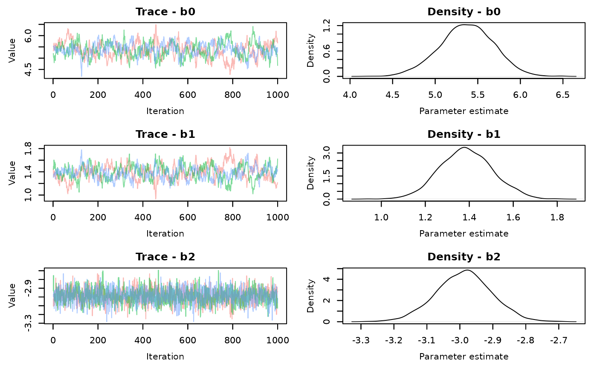
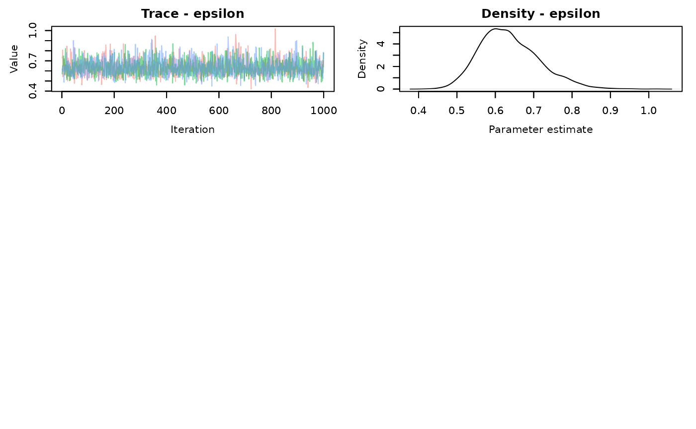

# Quick Nimble Demo

## Introduction

This is just a short demonstration on executing MCMC estimation of a
Bayesian model in Nimble. This is largely also covered in the [Nimble
user
manual](https://r-nimble.org/html_manual/cha-lightning-intro.html#sec:customizing-mcmc).
Specifically, this walks through executing Nimble “the long way” because
of several benefits. It lets you check your initial values before
compiling to avoid the Nimble equivalent of JAGS’s “Node inconsistent
with parents” or other errors and lets you customize the samplers for
individual or sets of parameters.

### Nimble vs. JAGS

Part of what makes Nimble more attractive, compared to JAGS, is the
speed with which it samples. Some of the speed comes from some
computer-background-blackbox stuff that, unless you want to do a deep
dive into programming, doesn’t matter (compiling,running in C++). That
adds an extra step in getting your model to run. This is *part* of what
makes Nimble more efficient. The other part comes from the type of
samplers (the algorithm used to perform MCMC estimation) you can
specify.

JAGS generally limits your ability to specify samplers for model
parameters. It’s sometimes better this way, but not always. For example,
if you have a linear model with many regression coefficients, you may
find that JAGS samples very slowly and the resulting chains mix poorly.
That is probably because the default sampler (which you can’t change) is
a slice sampler. It works on each regression coefficient individually,
trying to sample one coefficient at a time. Slice sampling like this can
be slow, but often results in chains with more independent samples/
lower autocorrelation.

Nimble provides default samplers, but lets you adjust them as you like.
The default sampler in Nimble for most parameters (or at least
continuous value ones, like regression coefficients) is a random-walk
(Metropolis-Hastings) sampler. It’s very quick, but tends to lead to
chains with greater autocorrelation than a slice sampler, so you need to
run longer chains to achieve similar effective sample sizes. However,
Nimble lets you specify block samplers. This means that, rather than
sampling regression coefficients individually, you can sample them
together. This tends to be slower, but results in less autocorrelation
and improved mixing.

## Running Nimble

We’ll walk through an example below using simulated data. One real nice
thing about Nimble is that it uses the BUGS programming language to
write a model so any older models from JAGS should be able to be used in
Nimble (there are even functions to do that).

- Simulating data
- Nimble model setup
- Configure the MCMC and setting monitors
- Build and Compile MCMC
- Run model/get MCMC samples

``` r
#simulate a multiple  regression  model


sim.dat<-function(N){

mu<-5

b.1<-1.5

b.2<--3


x.1<-runif(N,1,4)
x.2<-runif(N,-2,2)
err<-rnorm(N,0,0.5)

y<-mu+b.1*x.1+b.2*x.2+err

out.list<-list(y=y,x1=x.1,x2=x.2)

return(out.list)
}
```

Next, write the model in BUGS that we’ll use to estimate parameters

``` r
library(nimble)
#> nimble version 1.4.0 is loaded.
#> For more information on NIMBLE and a User Manual,
#> please visit https://R-nimble.org.
#> 
#> Attaching package: 'nimble'
#> The following object is masked from 'package:stats':
#> 
#>     simulate
#> The following object is masked from 'package:base':
#> 
#>     declare

demo.code<-nimbleCode({
  #priors
  b0~dnorm(0,sd=100)
  b1~dnorm(0,sd=100)
  b2~dnorm(0,sd=100)
  epsilon~dunif(0,10) # residual variance
  
  #model
  
for (i in 1:n){
  
  mu[i]<-b0+b1*x1[i]+b2*x2[i]
  
  y[i]~dnorm(mu[i],sd=epsilon)
}
  })
```

You may have already noticed, but another thing you can do in Nimble is
specify priors using a standard deviation instead of precision. If you
don’t include **sd=** in the distribution, Nimble will assume it’s
precision, so be sure you specify that part of your prior distribution
carefully.

Next, prepare the data. For data, Nimble is different from JAGS in that
it makes a distinction between constants and data. Data are exclusively
quantities that come from stochastic nodes. In our model above, the only
data we are supplying is the observed outcomes \\y_i\\. The covariates
we measured \\x\_{1i},x\_{2i}\\ get supplied as constants. Any variable
we want to use for indexing (**n** above, in the **for** loop) is also a
constant.

``` r
set.seed(12345)
demo.dat<-sim.dat(40)

nim.dat<-list(y=demo.dat$y)

nim.const<-list(n=length(demo.dat$x2),
              x1=demo.dat$x1,
                x2=demo.dat$x2)

nim.inits<-function(){list(
  #epsilon=runif(1,-5,0),
  b0=rnorm(1,0,1), 
  b1=rnorm(1,0,1),
  b2=rnorm(1,0,1)

)}
```

Now we also set up the functions to generate initial values for each
MCMC chain. It’s better (but not always essential) to have initial
values provided via a function to ensure that the chains all don’t start
from the same value. It’s not always critical to provide initial values
if the model mixes well, but in the event mixing is poor, starting
chains from different parameter values can help ensure MCMC is searching
the widest range of potential values possible (sampling from the full
parameter space). The above initial value has epsilon commented out to
facilitate demonstration of some other aspects of Nimble later on.

Now you bundle the data, code, constants, and initial values together in
what we’ll call a model object

``` r

demo.mod<-nimbleModel(code=demo.code,
                      data=nim.dat,
                      constants = nim.const,
                      inits=nim.inits()) # remember the () for the initial values function!
#> Defining model
#> Building model
#> Setting data and initial values
#> Running calculate on model
#>   [Note] Any error reports that follow may simply reflect missing values in model variables.
#> Checking model sizes and dimensions
#>   [Note] This model is not fully initialized. This is not an error.
#>          To see which variables are not initialized, use model$initializeInfo().
#>          For more information on model initialization, see help(modelInitialization).
```

You should see a message about the model not being fully initialized.
This usually means there is a parameter you can provide an initial value
for, but did not. In this case it’s epsilon, the residual variance. This
is where the first useful tool in Nimble comes in. Before you even start
trying to sample, you can get a sense of if the model will run properly.

The message tells you to use **model\$initializeInfo()**. This should
tell you that you have nodes without initial values.

``` r
demo.mod$initializeInfo()
#>   [Note] Missing values (NAs) or non-finite values were found in model variables: epsilon.
#>   [Note] This is not an error, but some or all variables may need to be initialized for certain algorithms to operate properly.
#>   [Note] For more information on model initialization, see help(modelInitialization).

demo.mod$calculate()
#> [1] NA

demo.mod$calculate('epsilon')
#> [1] NA
```

It’s not always fatal, but it’s a good practice to try and provide
initial values. the second command **\$calculate()** tries to calculate
the log probability density of the model from initial values. In
hierarchical models, an NA here will mean your model probably won’t run,
but with simpler models, we can try. You can also check particular nodes
to see which are giving you trouble.

We know from **intializeInfo()** that the NA is because we didn’t
provide a value for \\epsilon\\ in the initial values. Sometimes though,
you will still get an NA even if you have provided a starting value. If
that happens, you’ll need to check individual nodes to determine which
are giving you trouble and make adjustments to the prior, initial value,
or both. This may require overwriting (re-run) the **nimbleCode** and/or
**nimbleModel** objects repeatedly.

Just for the sake of demonstration, we’ll fix our above issue by
providing an intial value for epsilon

``` r
nim.inits<-function(){list(
  epsilon=runif(1,0.001,5),
  b0=rnorm(1,0,1), 
  b1=rnorm(1,0,1),
  b2=rnorm(1,0,1)

)}


demo.mod<-nimbleModel(code=demo.code,
                      data=nim.dat,
                      constants = nim.const,
                      inits=nim.inits())
#> Defining model
#> Building model
#> Setting data and initial values
#> Running calculate on model
#>   [Note] Any error reports that follow may simply reflect missing values in model variables.
#> Checking model sizes and dimensions


demo.mod$initializeInfo()
#>   [Note] All model variables are initialized.

demo.mod$calculate()
#> [1] -211.9384

demo.mod$calculate('epsilon')
#> [1] -2.302585
```

Once you sort out the initial values and create the model object, you
configure the MCMC sampler.

``` r
demo.config<-configureMCMC(demo.mod)
#> ===== Monitors =====
#> thin = 1: b0, b1, b2, epsilon
#> ===== Samplers =====
#> RW sampler (1)
#>   - epsilon
#> conjugate sampler (3)
#>   - b0
#>   - b1
#>   - b2

demo.config
#> ===== Monitors =====
#> thin = 1: b0, b1, b2, epsilon
#> ===== Samplers =====
#> RW sampler (1)
#>   - epsilon
#> conjugate sampler (3)
#>   - b0
#>   - b1
#>   - b2
```

Nimble should automatically print what nodes are monitored and what the
assigned samplers are when you execute **configureMCMC** but if you call
the object, it will appear again.

In this case, the conjugate sampler is assigned to the regression
coefficients because the prior and the likelihood (the distribution of
the observation) are the same (normal). If this were a glm, they
wouldn’t be conjugate because the likelihood would possibly be Poisson,
logit, or another distribution. They would be a random walk sampler,
like epsilon. Conjugate samplers are are a default and might not be the
best but do generally perform well.

Now though, is where you would want to adjust samplers. To do so, we
will set up a second configuration to use later on, rather than bouncing
back and forth. Here, we set the sampler for the residual variance to be
a slice sampler. And set the regression coefficients (b0, b1, b2) to use
an automated factor slice sampler, **AF_slice**. This is is a form of
block sampler. There is also a **RW_block** sampler, but the former
often performs better. Again, blocking parameters just means these
parameters are sampled together, rather than individually. In practice,
it most likely is most applicable to use for regression coefficients,
but it’s something you can play around with. It is a slice sampler, so
it will only work for parameters that are numerical, not categorical or
binary.

[You can see the list of possible samplers and a brief explanation
here](https://search.r-project.org/CRAN/refmans/nimble/html/samplers.html)

``` r
demo.config.alt<-configureMCMC(demo.mod)
#> ===== Monitors =====
#> thin = 1: b0, b1, b2, epsilon
#> ===== Samplers =====
#> RW sampler (1)
#>   - epsilon
#> conjugate sampler (3)
#>   - b0
#>   - b1
#>   - b2

demo.config.alt$replaceSamplers(target='epsilon',
                                type='slice')
demo.config.alt$replaceSamplers(target=c('b0','b1','b2'),
                                type='AF_slice')
demo.config
#> ===== Monitors =====
#> thin = 1: b0, b1, b2, epsilon
#> ===== Samplers =====
#> RW sampler (1)
#>   - epsilon
#> conjugate sampler (3)
#>   - b0
#>   - b1
#>   - b2
demo.config.alt
#> ===== Monitors =====
#> thin = 1: b0, b1, b2, epsilon
#> ===== Samplers =====
#> slice sampler (1)
#>   - epsilon
#> AF_slice sampler (1)
#>   - b0, b1, b2

# A third sampler configuration could be having each parameter be a slice sampler and sampled independently (targetByNode=TRUE).
# This should be slower than RW or conjugate samplers, but have better mixing. It will be slower than the AF_slice sampler.
#### not run

#
 # demo.config.alt$replaceSamplers(target=c('b0','b1','b2','epsilon'),
 #                             type='slice',
 #                              targetByNode=TRUE)
```

Nimble converts your model, data, and MCMC algorithms to C++ which makes
them run faster when it’s sampling. There is an added cost though, that
you need to build an MCMC sampler object and compile the model first. It
takes time but just involves running 3 simple commands. 1.)
**buildMCMC** using the configuration object, leading to an MCMC object
2.) **compileNimble** using the model object, leading to a compiled
model 3.) **compileNimble** using the compiled model and the MCMC object
you just created

We will do it twice to ensure we have everything we need to compare the
RW sampler to the slice sampler.

``` r

#----------- RW sampler on epsilon---------------------------


demo.build<-nimble::buildMCMC(demo.config) # build MCMC


demo.comp.mod<-nimble::compileNimble(demo.mod)   #first compile step


demo.comp.mcmc<-nimble::compileNimble(demo.build, project=demo.comp.mod) # second compile step


#----------- Slice sampler on epsilon


alt.build<-nimble::buildMCMC(demo.config.alt) # build MCMC


alt.comp.mod<-nimble::compileNimble(demo.mod)   #first compile step


alt.comp.mcmc<-nimble::compileNimble(alt.build, project=alt.comp.mod) # second compile step
```

Now you can execute the the model and obtain your MCMC samples. This is
where you set your iterations, burning, chains, and thinning. We can use
the
[MCMCvis](https://cran.r-project.org/web/packages/MCMCvis/vignettes/MCMCvis.html)
to review summary statistics and view traceplots. We also use calls of
**Sys.time()** to also track how long each sampler configuration runs.

``` r

#-----------RW samplers
RW.start<-Sys.time()
demo.samples<-nimble::runMCMC(demo.comp.mcmc,
                         niter=2000,
                         nburnin = 1000,
                         nchains = 3)
RW.end<-Sys.time()

RW.time<-RW.end-RW.start


#------------slice sampler


slice.start<-Sys.time()

alt.samples<-nimble::runMCMC(alt.comp.mcmc,
                         niter=2000,
                         nburnin = 1000,
                         nchains = 3)

slice.end<-Sys.time()

slice.time<-slice.end-slice.start
```

Look at the traceplots of each

``` r
MCMCvis::MCMCtrace(demo.samples,pdf=FALSE)
```



``` r

MCMCvis::MCMCtrace(alt.samples,pdf=FALSE)
```



There is better mixing for the slice sampling. Check the summary
statistics

``` r

MCMCvis::MCMCsummary(demo.samples)->RW.summary
RW.summary
#>               mean         sd       2.5%        50%      97.5% Rhat n.eff
#> b0       5.3688498 0.31668017  4.7181530  5.3740203  5.9720205 1.02   167
#> b1       1.3864821 0.12001356  1.1585818  1.3836834  1.6237416 1.02   165
#> b2      -2.9880842 0.08505345 -3.1549402 -2.9864336 -2.8260734 1.00  1308
#> epsilon  0.6318047 0.07263246  0.5129054  0.6259802  0.7989728 1.00   798


MCMCvis::MCMCsummary(alt.samples)->slice.summary
slice.summary
#>               mean         sd       2.5%       50%      97.5% Rhat n.eff
#> b0       5.4075780 0.32059372  4.7680382  5.410258  6.0419999 1.00  3240
#> b1       1.3725860 0.12049228  1.1322053  1.370473  1.6079879 1.00  3000
#> b2      -2.9830657 0.08727785 -3.1532691 -2.985470 -2.8062216 1.01  2718
#> epsilon  0.6368656 0.07732851  0.5076331  0.628372  0.8070473 1.00  2305
```

The effective sample size for each parameter is much larger using the
slice **AF_slice** sampler. There is a time difference, with the slice
sampler taking 0.55 seconds compared to the default samplers of 0.28
seconds. It’s not a large difference in this simple model, but that’s
about 2 times longer. That will scale up when your models start taking
longer to run.

There isn’t a clear answer about what samplers are ultimately better. It
could be the case that running the default samplers for more iterations
is quicker than using a block or slice sampler. Or, default samplers may
not converge or mix properly, regardless of how long you run them. This
will just be something you end up playing around with and testing.
