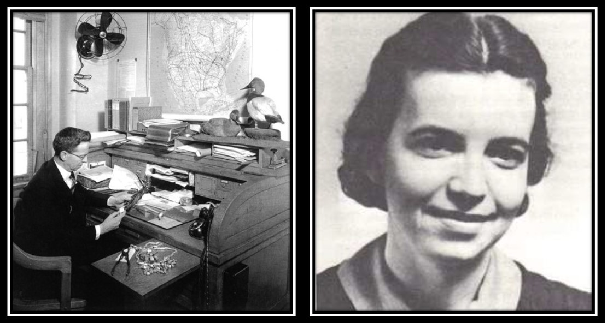

```{r, include = FALSE}
knitr::opts_chunk$set(
  collapse = TRUE,
  comment = "#>"
)
```

```{r setup, echo=FALSE,message=FALSE}
library(MDChelp)
```

## Introduction

Capture-recapture methods and related concepts are at the foundation of a plethora of methods and analytic techniques used in ecological. It can be difficult to know how best to design a study or even what type of data to collect without first having some kind of an idea of the analysis you might perform. The goal of these notes is to provide a *very* basic overview of what you can do with capture-recapture methods, the basic data needs and assumptions, and provide some basic tools to help guide the development of projects. There are many, many books that cover this topic with much better clarity and detail, but three that may be helpful in particular are:

* [Estimation of Parameters for Animal Populations (Powell and Gale 2015)](https://larkinpowell.wixsite.com/larkinpowell/estimation-of-parameters-for-animal-pop)
* [Population Ecology in Practice (Murray and Sandercock 2022)](www.wiley.com/go/MurayPopulationEcology)
* [Program Mark "A Gentle Introduction"](www.phidot.org)

These offer more comprehensive discussions of specific types of models without being overly technical (the first two), though the "Gentle Introduction" goes into much more discussion about a given model, while also giving guidance on their implementation in Program MARK.

This and related articles are meant to be a quick reference, to help make you aware of what is out there and is in no way comprehensive enough to be the only resource you use. You should definitely read relevant sections of these or other books, papers, or consult with one of the biometricians if you identify a technique you are interested in using for a project.

## Key Terminology and Concepts

There are some characteristics/concepts that help frame/organize/differentiate among the plethora of methods and serve as the basis of critical assumptions. When looking into more specific methods or models, you'll see these terms being referenced frequently.


### Model assumptions: open or closed populations 

Whether a population can be classified as open or closed defines most capture-recapture methods and is a critical assumption in different models. Closed is simpler to define, as there are a few different processes that makes a population "open". Most simply, a **closed population** means that, for the time you are observing your animals, there are no births, deaths, or immigration or emigration of any kind. The animals you do (or could) observe or capture are the same individuals and do not change. If births, deaths, or movement into or out of your study area exist, during your data collection, then you have an **open population**. It's an important concept to understand, but not always black in white in practice. The lines between "open" and "closed" populations (and related statistical models) blur because only some processes are relevant to a particular model (deaths and emigration, Cormack-Jolly-Seber), or because of how you structure your data collection and define a time frame.

* **Example:** If I go and capture and mark birds in a field to estimate abundance each year for 5 years, clearly those are not all the same birds. Between years, or even within a year, birds can be born, can move into the field, leave the field, or die. However, during the time I am marking birds in a given year, if <u>none</u> of those processes occur, then, for the purposes of my data collection and analysis, I have a closed population. I can then use a model that assumes I have a closed population to analyze the data from each year. Thus, depending on what it is you are interested in measuring and how you design your data collection, you can sometimes treat what is truly an "open" population as being closed.

* **Example:** The Cormack-Jolly-Seber (CJS) model is considered an "open" population model because you expect individuals to die and you estimate the apparent survival of individuals between encounters. It's called apparent survival because if you also have individuals leave  the study area (emigrate), you can't differentiate between deaths and leaving. However, if you *can* safely assume that individuals don't leave, but the population is **open** (because individuals can still die), then you are estimating true survival. Movement into the population or births don't matter in this instance, because the CJS a model only tries to estimate apparent survival.

Being able to think about how the concept of open or closed populations relates to your study organism, question, and data collection is key as it is the backbone of virtually every statistical model you will use and acts as an important building block, permitting you to use more complex models to answer complex questions.

#### Conditioning on initial capture or modeling the initial capture (full capture history)

It is less important to understand this in detail at this stage, but it's an important technical concept that applies to open-population models. Conditioning on the initial capture just means you don't particularly care about modeling the initial capture of the animal, you only care about what happens after you have caught and released it. Methods like Cormack-Jolly-Seber ignore the initial capture process and only try to estimate apparent survival and *re*capture probability. Other models <u>*do*</u> try to explicitly model the initial capture process (e.g. Jolly-Seber, Pradel, POPAN, closed-capture).

What does each approach get you? By explicitly trying to model the initial capture, you can also start to estimate parameters like abundance and population growth rate. When you condition on the initial capture, you skip all that and only focus on what happens to those animals afterwards, typically focusing on apparent survival or movement. 

So why not always model the initial capture if it gets you more information about the animal population? Logistically, it can be challenging. Modeling the initial capture requires that you are constantly capturing and marking animals throughout time. It's not easy to support that kind of effort and as a result. Full capture history methods might not work well for studies that only last a few years or where animals are captured and marked on very few occasions, relative to how frequently they may be encountered (e.g. waterfowl banding, translocation studies). You also need to have the method of initial capture be the same as subsequent encounters. Finally, the estimates for some parameters (like abundance) might not be that good. In closed-capture models, there is a lot of focus on dealing with issues related to heterogeneity in capture probability, whether it's trap-response, age/cohort/time differences, etc. That complexity doesn't go away, and probably gets worse in open models. You can't deal with in open models like you can in closed models (but see "robust design" models). Still, using the full capture history can allow you to estimate other parameters (that aren't as affected by theses issues) that can be pretty interesting, like [migratory behavior](https://bioone.org/journals/the-condor/volume-116/issue-2/CONDOR-13-114.1/Stopover-ecology-of-American-Golden-Plovers-Pluvialis-dominica-in-Midwestern/10.1650/CONDOR-13-114.1.short) or [hunter participation](https://wildlife.onlinelibrary.wiley.com/doi/pdfdirect/10.1002/jwmg.22553).

### Estimating abundance or demographic parameters

Another way to subdivide these models is whether the goal is to estimate abundance or demographic parameters (e.g., survival, recruitment, population growth rate, etc.). There are methods that do both but this is one of the key ways to differentiate among methods. There are both open and closed models that can do this as well.  Examples of specific capture-recapture methods that focus on estimating abundance are:


* Lincoln-Petersen (closed)
* Jolly-Seber (open)
* Closed Capture recapture (closed)

Models/ approaches that focus on demographic parameters are by definition, open models, but may not account for all processes (immigration/emigration, survival, etc.). Some models that primarily focus on demographic processes are :

* Cormack-Jolly-Seber (CJS)
* Jolly Seber
* Pradel 
* Robust Design (combines closed and open processes)
* Brownie/Seber (Dead encounters)


### Unique or generic markings

Not all approaches require you to be able to uniquely identify individuals. Sometimes the organism is too small to be marked with a unique tag, such tags are more likely to be lost compared to other marking techniques (e.g scute marking on turtles, fin clips), or other animal welfare or logistical concerns prevent unique identification. However, you generally have more flexibility if you can uniquely identify individuals. The frequent reality that, for models that use generic markings, many key assumptions cannot be met has generally led to most researchers to use individually identifiable markings. Still, there are cases where generic markings are useful (e.g. estimating waterfowl abundance from direct band recoveries) and you can always "anonymize" your uniquely marked organisms for a model that only requires generic markings.

```{r,echo=FALSE, fig.cap="**Lincoln (L) and Schnabel (R)**", out.width="50%",fig.align='center'}

``` 

The Lincoln-Petersen index and related estimators (e.g. Chao, Schnabel), Jolly-Seber, and some types of mark-resight models can use information about generic markings, but they come with relatively more strict assumptions. All of these approaches have alternatives or different formulations that utilize unique markings that permit you to deal with real issues that can cause bias (e.g. capture probability heterogeneity, non-closure). The upshot is, you can do more and deal with violations of assumptions more easily with unique markings. Options still exist for generic marking, and often, some clever sampling design and help ensure critical model assumptions are met. 


### Summary and Extensions

There is what may seem to be an overwhelming number of capture-recapture based methods in the literature and clarifying what discriminates among them and the key assumptions can help sift through them. Understanding key concepts like population closure is critical not just to using these models correctly, but is important for other methods based on capture recapture (e.g. N-mixture models), or adapting these models to novel applications^[Stodola et al. 2014. Stopover ecology of American Golden-Plovers in Midwestern agricultural fields. https://bioone.org/journals/the-condor/volume-116/issue-2/CONDOR-13-114.1/Stopover-ecology-of-American-Golden-Plovers-Pluvialis-dominica-in-Midwestern/10.1650/CONDOR-13-114.1.short] ^[Graham et al. 2023. Exploring the population dynamcis of waterfowl hunters using a mark-recapture approach. https://wildlife.onlinelibrary.wiley.com/doi/pdfdirect/10.1002/jwmg.22553] 

